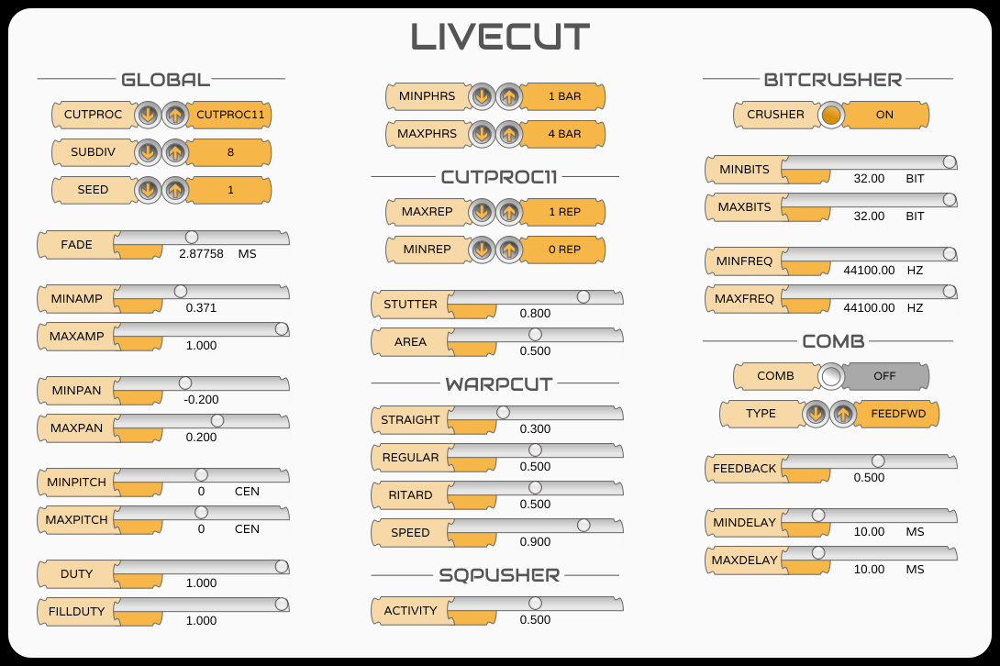

# LiveCut Redux

A version of the [Livecut](https://github.com/mdsp/Livecut) beat-slicer audio plugin, adapted for a more recent JUCE plugin framework.

<br/>

# Notes

This version has been renamed to LiveCut-Redux, and installing it will not update the old version (named LiveCut). This is because LiveCut-Redux uses a different plugin framework, so can't replace LiveCut in existing DAW projects.

LiveCut-Redux is at an early stage of development and hasn't been tested with many DAWs on different platforms yet.

# Usage:

You can double click on the slider readouts to enter a value directly.

A guide to using LiveCut prepared by [The Micronauts](https://github.com/TheMicronauts) [https://github.com/TheMicronauts](https://github.com/TheMicronauts) is available here: [https://github.com/TheMicronauts/LiveCut-Guide/releases/download/v1.0.0/LiveCut-Guide.rtf](https://github.com/TheMicronauts/LiveCut-Guide/releases/download/v1.0.0/LiveCut-Guide.rtf) (French).

See [https://web.archive.org/web/20071021014423/http://mdsp.smartelectronix.com/doc/index.php/Livecut](https://web.archive.org/web/20071021014423/http://mdsp.smartelectronix.com/doc/index.php/Livecut) for the original guide to the various Livecut parameters.

# Building

First clone the repository:
```
git clone --recursive https://github.com/eventual-recluse/LiveCut-Redux.git
cd LiveCut
```

Then build with CMake:

For a Debug build:
```
cmake -S . -B ./cmake-build -DCMAKE_BUILD_TYPE=Debug
cmake --build ./cmake-build --config Debug
```

... or for a Release build:
```
cmake -S . -B ./cmake-build -DCMAKE_BUILD_TYPE=Release
cmake --build ./cmake-build --config Release
```

# Credits
[Livecut](https://github.com/mdsp/Livecut) by mdsp @ smartelectronix. Livecut Copyright 2004 by Remy Muller. GPL license.

[JUCE Framework.](https://github.com/juce-framework/JUCE) AGPLv3 license.

[clap-juce-extensions.](https://github.com/free-audio/clap-juce-extensions/) MIT license.

[Audiowide Font](https://fonts.google.com/specimen/Audiowide) designed by Astigmatic. [Open Font License.](https://scripts.sil.org/cms/scripts/page.php?site_id=nrsi&id=OFL)

[Varela Font](https://fonts.google.com/specimen/Varela) designed by Joe Prince. [Open Font License.](https://scripts.sil.org/cms/scripts/page.php?site_id=nrsi&id=OFL)

Livecut
=======

Livecut is based on BBCut, the BreakBeat Cutting library written by Nick Collins for SuperCollider.

The BBCut Library began out of work on an algorithm to simulate the automatic cutting of breakbeats in the style of early jungle or drum and bass, Nick Collins.

Livecut is only a small subset of what is possible with BBCut, but as it is available as a VST plugin, it is much easier to start experimenting with it.

It is a live beat-slicer but instead of manipulating equal chunks of audio like most beatslicer do, it works on the notion of audio *cuts* whose length and number of repetition depends on the context and the cutting procedure. 
*Cuts* are organized in *blocks* which then form a *phrase*. And each phrase can be ended by a *roll* or *fill*.
